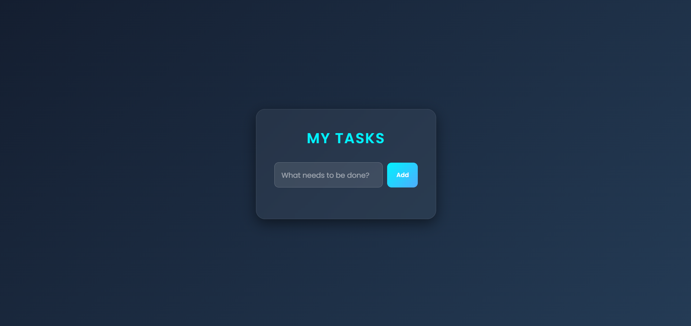
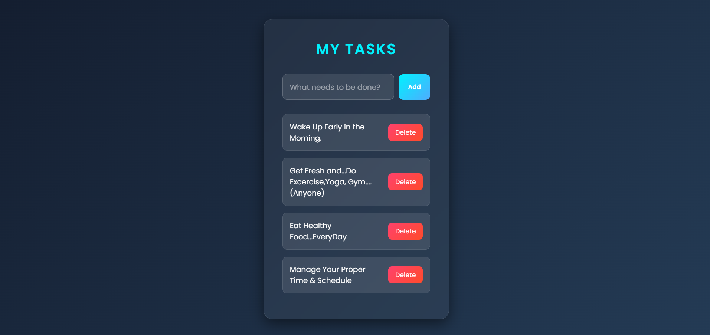
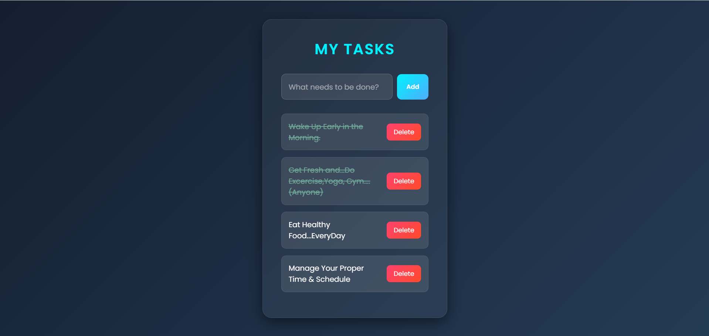

# Task-Management-Dashboard

A modern Task Management Dashboard that helps users organize daily activities by adding, completing, and deleting tasks. Task data is stored using Local Storage, allowing tasks to remain available even after refreshing the page.

## ✨ Features

- Add new tasks
- Mark tasks as completed or incomplete
- Delete tasks
- Task status tracking
- Data persistence using Local Storage
- Responsive and modern dashboard design
- User-friendly interface

## 🛠️ Technologies Used

- HTML5
- CSS3
- JavaScript

## 📸 Screenshots

### Dashboard View

### Task Management

### Completed Tasks

## 📚 What I Learned

- DOM Manipulation
- Event Handling
- Local Storage API
- Dynamic Element Creation
- Array and Object Management
- Conditional Rendering
- Responsive UI Design

## 🎯 Purpose of Project

This project was created to strengthen JavaScript fundamentals by building a practical task management application that handles real-time user interactions and browser storage.

## 🚀 Future Improvements

- Task Categories
- Due Dates
- Priority Levels
- Search and Filter Tasks
- Dark / Light Theme Toggle

## 👩‍💻 Author

Nikita
